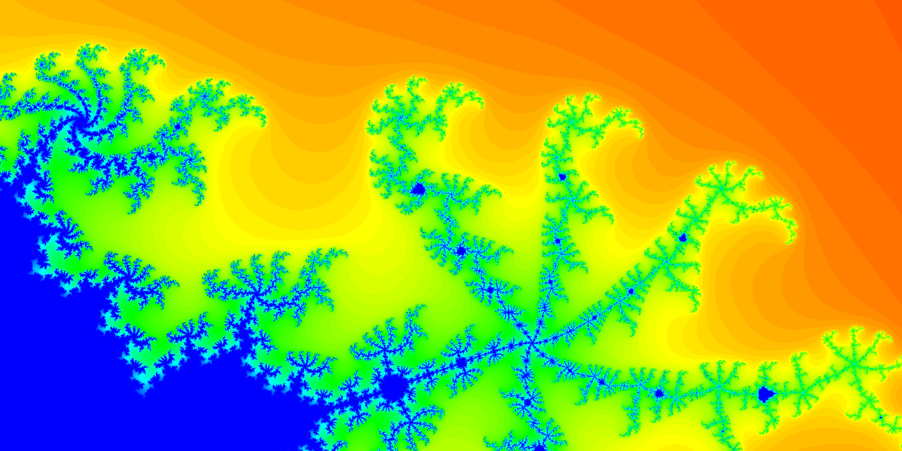

# WebApp

A full-stack application plotting the [Mandelbrot set](https://mathworld.wolfram.com/MandelbrotSet.html).



## Installation

Download an install the `WebApp` package:

```shell
git clone https://github.com/UniExeterRSE/WebApp.git
cd WebApp
poetry install
```

## Running

To run the application:

```shell
poetry run uvicorn app.api.main:app --reload
```

## Testing

Run the test harness, with code-coverage, using:

```shell
poetry run pytest --cache-clear --cov=my_library ./tests/
```

## Documentation

Build a local set of the documentation using the command:

```shell
poetry run sphinx-build -b html docs/source/ docs/build/html
```